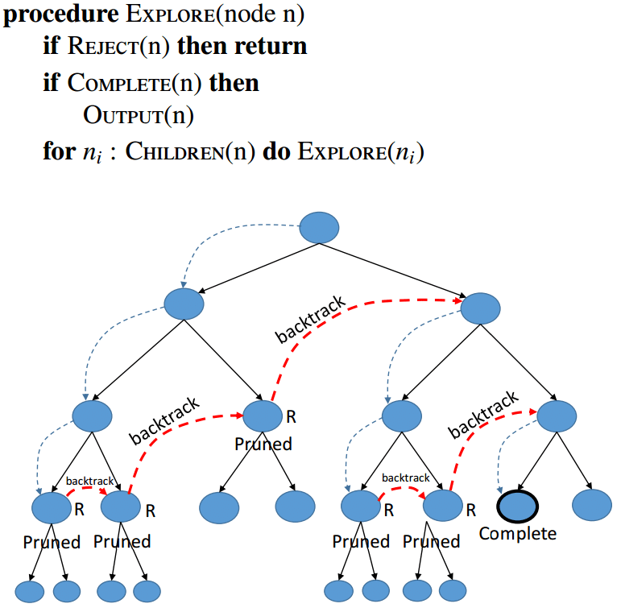

# Sudoku puzzle solver 

Sudoku is one of the most popular puzzle games of all time. The goal of Sudoku is to fill a 9×9 grid with numbers so that each row, column and 3×3 section contain all of the digits between 1 and 9.

# About sudoku

The popular Japanese puzzle game Sudoku is based on the logical placement of numbers. An online game of logic, Sudoku doesn’t require any calculation nor special math skills; all that is needed are brains and concentration.

# How to play It 

The goal of Sudoku is to fill in a 9×9 grid with digits so that each column, row, and 3×3 section contain the numbers between 1 to 9. At the beginning of the game, the 9×9 grid will have some of the squares filled in. Your job is to use logic to fill in the missing digits and complete the grid. Don’t forget, a move is incorrect if :
*  Any row contains more than one of the same number from 1 to 9.
* Any column contains more than one of the same number from 1 to 9.
* Any 3×3 grid contains more than one of the same number from 1 to 9

## Here is the simplified algorithm flowchart that describes how to solve the puzzle

<p align="center"></p>

## Js Solution
```
https://github.com/RedaMeziouni/Sudoku-Game-Solver/tree/main/JavaScriptSolution
```

## Python Solution
```
https://github.com/RedaMeziouni/Sudoku-Game-Solver/tree/main/PythonSolution
```

## Java Solution
```
https://github.com/RedaMeziouni/Sudoku-Game-Solver/tree/main/JavaSolution
```

## learn more about backtracking

<p align="center"></p>

```
https://www.programiz.com/dsa/backtracking-algorithm
```