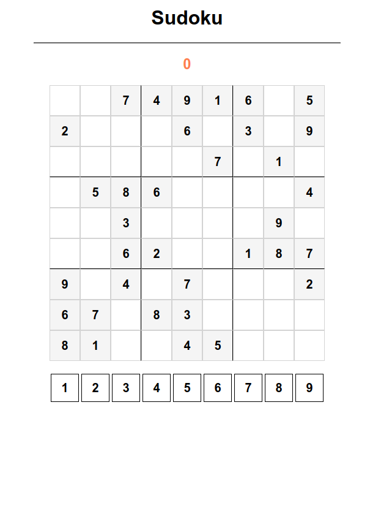

# Basic Sudoku Game (9x9 board)

A simple implementation of the Sudoku game using HTML, CSS and JavaScript to add logic (select numbers, place them on the tile and check for errors and solution).

## Preview

